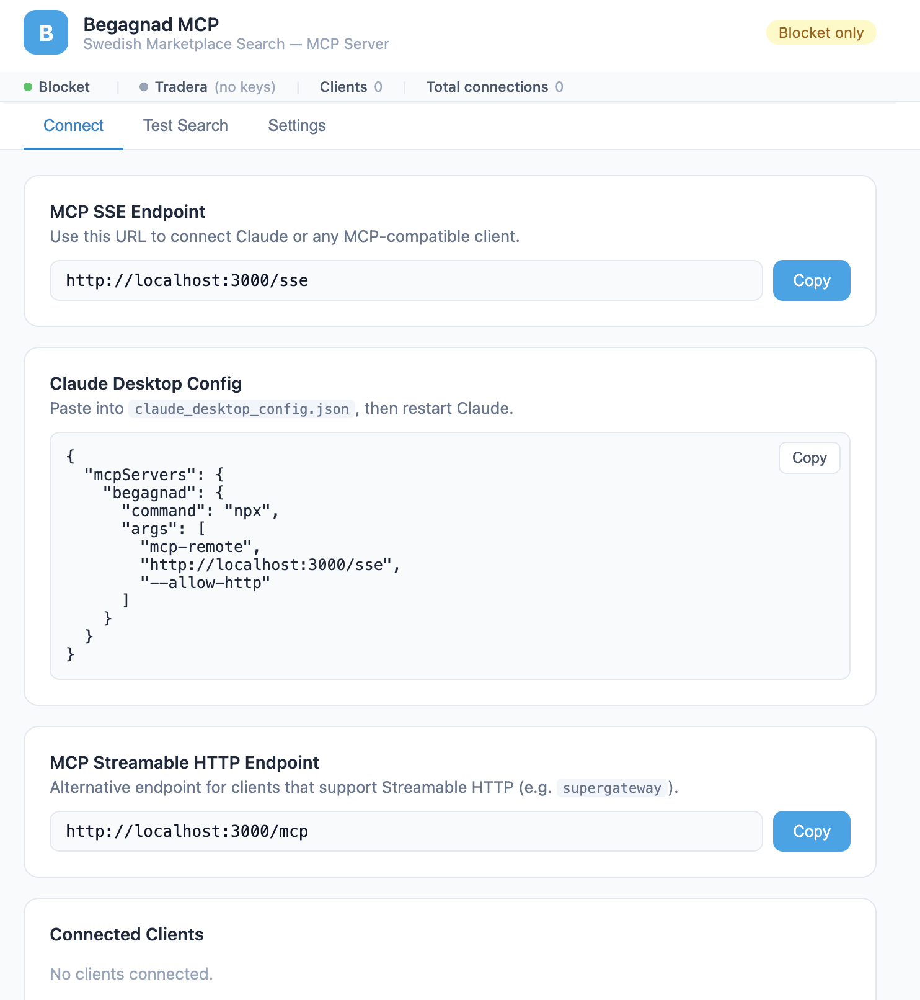

# Begagnad MCP

MCP server for searching Swedish second-hand marketplaces through a single interface.

It currently supports:

- `Blocket`
- `Tradera` when API credentials are configured

The repo contains two runtime modes:

- A local Node server with Web UI, SSE, and Streamable HTTP endpoints
- A Cloudflare Worker version for remote deployment

## Features

- Unified search tools for Blocket and Tradera
- Local Web UI for setup, health, and test searches
- MCP over `SSE` and Streamable HTTP
- Docker-friendly local deployment
- Optional stdio mode for containerized MCP clients

## Quick Start

### Docker Without Cloning

Build the image directly from GitHub:

```bash
docker build https://github.com/htilly/begagnad-mcp.git -t begagnad-mcp
docker run --rm -p 3000:3000 -v begagnad-mcp-data:/data begagnad-mcp
```

Then open:

- Web UI: `http://localhost:3000/`
- SSE endpoint: `http://localhost:3000/sse`
- Streamable HTTP endpoint: `http://localhost:3000/mcp`

With Tradera credentials:

```bash
docker run --rm -p 3000:3000 -v begagnad-mcp-data:/data \
  -e TRADERA_APP_ID=your_app_id \
  -e TRADERA_APP_KEY=your_app_key \
  begagnad-mcp
```

### Docker Compose

From a checkout of this repo:

```bash
docker compose up --build
```

`docker-compose.yml` uses the Dockerfile default build mode, which clones `https://github.com/htilly/begagnad-mcp.git` inside the build stage. To build from the current checkout instead, override the build arg:

```bash
docker compose build --build-arg SOURCE=local
docker compose up
```

Tradera credentials can be supplied either:

- In the Web UI under `Settings`
- As environment variables in your shell before `docker compose up`

```bash
export TRADERA_APP_ID=your_app_id
export TRADERA_APP_KEY=your_app_key
docker compose up --build
```

Optional Tradera rate-limit overrides:

```bash
export TRADERA_RATE_LIMIT_MAX_CALLS=100
export TRADERA_RATE_LIMIT_WINDOW_MS=86400000
export TRADERA_HEALTH_CHECK_INTERVAL_MS=86400000
export TRADERA_RATE_LIMIT_STATE_PATH=/data/tradera-rate-limit.json
```

Notes:

- The `./data` directory is mounted into the container as `/data`.
- Saved Web UI credentials are written to `/data/config.json`.

### Docker Stdio Mode

If you want to run the container as a stdio MCP server instead of the local web server:

```bash
docker build https://github.com/htilly/begagnad-mcp.git -t begagnad-mcp
docker run --rm -i \
  -e MCP_STDIO=1 \
  -e TRADERA_APP_ID=your_app_id \
  -e TRADERA_APP_KEY=your_app_key \
  begagnad-mcp
```

## Local Development

### Local Node Server

The Node server is the runtime that serves the Web UI and local MCP endpoints:

```bash
npm ci
npm run build:node
npm run start:node
```

Available locally:

- Web UI: `http://localhost:3000/`
- SSE endpoint: `http://localhost:3000/sse`
- Streamable HTTP endpoint: `http://localhost:3000/mcp`

### Cloudflare Worker Dev Mode

The Worker entrypoint is still available for Worker-focused development:

```bash
npm ci
npm start
```

That runs `wrangler dev` on the Worker, typically on `http://localhost:8788/`.

Use this mode when you are working on the Cloudflare deployment path, not when you need the local Node Web UI.

## Claude Desktop Setup

### Connect To The Local SSE Endpoint

```json
{
  "mcpServers": {
    "begagnad": {
      "command": "npx",
      "args": [
        "mcp-remote",
        "http://localhost:3000/sse",
        "--allow-http"
      ]
    }
  }
}
```

### Connect To A Deployed Endpoint

```json
{
  "mcpServers": {
    "begagnad": {
      "command": "npx",
      "args": [
        "mcp-remote",
        "https://begagnad-mcp.bjesus.workers.dev/sse"
      ]
    }
  }
}
```

Restart Claude Desktop after updating the config.

## Configuration

### Tradera Credentials

Tradera tools require:

- `TRADERA_APP_ID`
- `TRADERA_APP_KEY`

Supported configuration paths:

- Environment variables
- Web UI settings saved to `/data/config.json`
- `~/.config/begagnad-mcp/config.json` for stdio mode outside Docker

Example local config file:

```json
{
  "TRADERA_APP_ID": "your_app_id",
  "TRADERA_APP_KEY": "your_app_key"
}
```

If no Tradera credentials are present, the server still works for Blocket-only searches.

### Tradera Rate Limit

Tradera documents a default API limit of `100` calls per `24` hours and returns `HTTP 429` when it is exceeded. The server enforces that limit locally for all Tradera calls, including search, item lookup, and health checks.

Defaults:

- `TRADERA_RATE_LIMIT_MAX_CALLS=100`
- `TRADERA_RATE_LIMIT_WINDOW_MS=86400000`
- `TRADERA_HEALTH_CHECK_INTERVAL_MS=86400000`
- `TRADERA_RATE_LIMIT_STATE_PATH=/data/tradera-rate-limit.json` for the local Node server

If Tradera grants a higher quota, set the corresponding environment variables before starting the server or container.

## Available Tools

### `search_blocket`

Search Blocket listings.

Parameters:

- `query`: search string
- `limit`: optional result limit, default `20`

### `get_blocket_item`

Fetch a single Blocket listing by ad ID.

Parameters:

- `ad_id`: Blocket ad ID

### `search_tradera`

Search Tradera listings.

Parameters:

- `query`: search string
- `page`: optional page number, default `1`

### `get_tradera_item`

Fetch a single Tradera listing by item ID.

Parameters:

- `item_id`: Tradera item ID

### `search_both`

Search both marketplaces in one call.

Parameters:

- `query`: search string
- `blocket_limit`: optional Blocket limit, default `20`

## Web UI



The local Web UI exposes:

- Connection snippets for Claude Desktop
- SSE and Streamable HTTP endpoint URLs
- Connected client/session status
- Blocket and Tradera health checks
- A browser-based test search flow
- Tradera credential management

## Deploying To Cloudflare

```bash
npm ci
wrangler login
npm run deploy
```

After deployment, use the returned `/sse` endpoint with your MCP client.

You can also configure secrets directly in Cloudflare:

```bash
wrangler secret put TRADERA_APP_ID
wrangler secret put TRADERA_APP_KEY
```

## API Sources

- Blocket API: `https://blocket-api.se/v1/`
- Tradera API: `https://api.tradera.com/v3/`

## License

MIT
